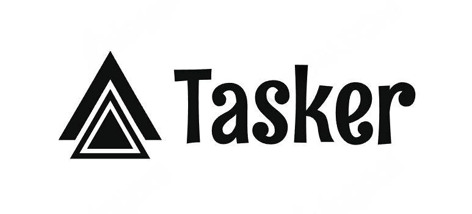

<div id="top"></div>

<!-- PROJECT LOGO -->
<br />
<div align="center">
  <a href="#">
    
  </a>

  <h1 align="center">Tasker</h1>

  <p align="center">
    A simple and organized React application for managing tasks effectively.
    <br />
    <a target="_blank" href="https://taskerprogram.netlify.app">View Demo</a>
  </p>
</div>

<!-- TABLE OF CONTENTS -->
<details>
  <summary>Table of Contents</summary>
  <ol>
    <li>
      <a href="#about-the-project">About The Project</a>
      <ul>
        <li><a href="#features">Features</a></li>
        <li><a href="#built-with">Built With</a></li>
      </ul>
    </li>
    <li>
      <a href="#getting-started">Getting Started</a>
      <ul>
        <li><a href="#installation">Installation</a></li>
        <li><a href="#tree-structure">Tree Structure</a></li>
      </ul>
    </li>
  </ol>
</details>

<!-- ABOUT THE PROJECT -->
## About The Project

The <strong>Tasker</strong> is a React application that helps you manage your daily tasks efficiently. It allows users to create, edit, and track tasks with features such as priority levels,history of tasks,and completion status.

### Features

- Add, edit, and delete tasks
- Set task priority and add task comments
- Mark tasks as complete
- Check Tasks History
- Simple, intuitive UI for a seamless user experience
- Search for Specific Tasks

### Built With

- React
- CSS3

<p align="right">(<a href="#top">back to top</a>)</p>

<!-- GETTING STARTED -->
## Getting Started

To get a local copy up and running, follow these steps.

### Installation

1. Clone the repository

   ```sh
   git clone https://github.com/Maid-Type/Tasker.git
   ```
   
2. Navigate to the project folder

   ```sh
   cd Tasker
   ```

3. Install dependencies

   ```sh
   npm install
   ```

4. Run the development server

   ```sh
   npm run dev
   ```
   
### Tree Structure

```sh
Tasker
├───index.html
│
│   .gitignore
│   package.json
│   README.md
│   package-lock.json
│   vite.config.js
│
├───src
│    ├───assets
│    ├───pages
│    │    ├───PageNotFound.jsx
│    │    └───TimedTasks.jsx
│    │
│    ├───components
│    │    ├───AddTask.jsx
│    │    ├───AddTask.module.css
│    │    ├───AppLayout.jsx
│    │    ├───AppLayout.module.css
│    │    ├───CancelledTasks.jsx
│    │    ├───CancelledTasks.module.css
│    │    ├───ConfirmedTasks.jsx
│    │    ├───ConfirmedTasks.module.css
│    │    ├───Error.jsx
│    │    ├───Error.module.css
│    │    ├───Header.jsx
│    │    ├───Header.module.css
│    │    ├───SearchTasks.jsx
│    │    ├───SearchTasks.module.css
│    │    ├───SideBar.jsx
│    │    ├───SideBar.module.css
│    │    ├───Spinner.jsx
│    │    ├───Spinner.module.css
│    │    ├───Table.jsx
│    │    ├───Table.module.css
│    │    ├───Task.jsx
│    │    ├───Task.module.css
│    │    ├───TaskManager.jsx
│    │    ├───TaskManager.module.css
│    │    ├───sideBarItem.jsx
│    │    └───TaskForm.jsx
│    │
│    ├───App.js
│    ├───App.css
│    ├───helpers.js
│    ├───index.css
│    └───main.jsx
│
└───public/assets
```